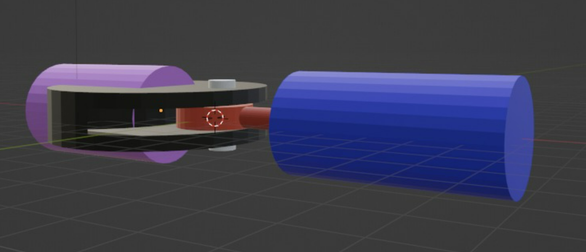

# Mech-Eng Second Task 🗣:

## Description 📝:
In this task, I explained the steps required to design the foot joint  

## Steps :star: :
The followed steps are explained in the link:  

[StepsToDesign.docx](https://github.com/alhanoofalsagir/Tire-suspention-System/files/9229589/StepsToDesign.docx)

## Result ✔️:

